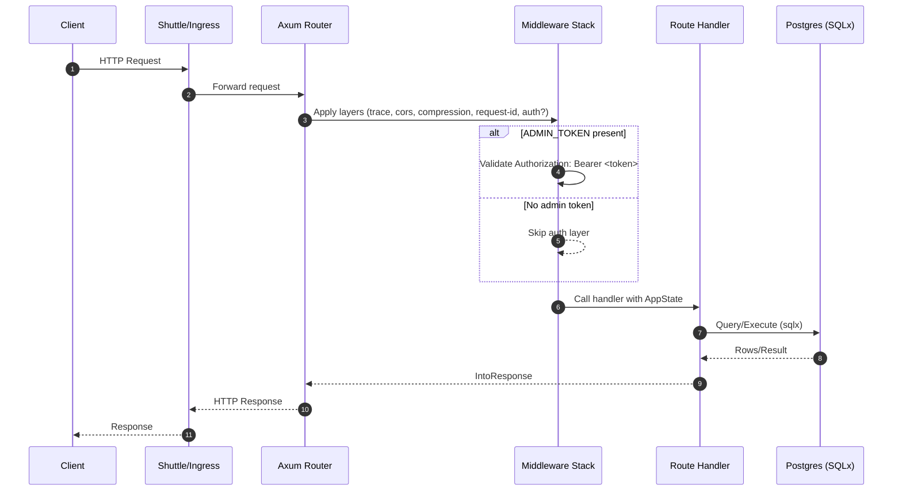

# Template Server (Axum + Shuttle) — Documentation

Welcome to the documentation hub for this Rust REST API template. It uses Axum for HTTP routing, SQLx for Postgres access, and Shuttle for zero-config deployment. This README gives you a high-level overview, a clickable index to deeper docs, and a request-flow diagram to understand how a request travels through the system.

- Language/runtime: Rust + Tokio
- Web framework: Axum
- Database: Postgres (SQLx, migrations at startup)
- Hosting: Shuttle (with Secrets for runtime configuration)
- HTTP tooling: tower and tower-http (request ID, CORS, compression, validation)

## Table of contents
- [Architecture at a glance](#architecture-at-a-glance)
- [Request flow diagram](#request-flow-diagram)
- [Key components](#key-components)
  - [Routes](#routes)
  - [Models](#models)
  - [Middleware](#middleware)
  - [Configuration](#configuration)
  - [Database](#database)
- [Security](#security)
- [Observability](#observability)
- [Local development](#local-development)
- [Testing](#testing)
- [Deployment](#deployment)
- [Directory index](#directory-index)

## Architecture at a glance
- The application boots via Shuttle’s runtime entrypoint and constructs an Axum Router from an AppState containing a Postgres pool and server configuration loaded from environment variables.
- Database migrations run automatically at startup using SQLx.
- If an ADMIN_TOKEN secret is present, all routes are guarded by a Bearer token validator layer.
- The router registers health and Todo endpoints (GET /todos, POST /todos) as examples.

See more details in [docs/architecture/README.md](architecture/README.md).

## Request flow diagram

## Key components
This repository is organized to keep concerns separate and documentation close to code. Start with these overviews, then follow the links to dedicated pages.

### Routes
- Examples: `GET /health`, `GET /todos`, `POST /todos`
- Handlers are in `src/routes/`
- See [docs/routes/README.md](routes/README.md)

### Models
- Example model: `Todo { id, title, description, done }`
- SQLx row mapping via `#[derive(sqlx::FromRow)]`
- See [docs/models/README.md](models/README.md)

### Middleware
- Typical layers: request ID, tracing, CORS, compression, (optional) bearer token validation
- Configurable via environment and server config
- See [docs/middleware/README.md](middleware/README.md)

### Configuration
- ServerConfig loads from environment with sensible defaults
  - REQUEST_ID_HEADER (default: x-request-id)
  - TIMEOUT_SECS (default: 15)
  - CORS_DISABLED (set any value to disable)
  - CORS_ALLOWED_ORIGINS (comma-separated allow-list)
- See [docs/config/README.md](config/README.md)

### Database
- Postgres with SQLx; migrations run at startup
- Example table: `todos (id BIGSERIAL PRIMARY KEY, title TEXT, description TEXT, done BOOLEAN)`
- See [docs/database/README.md](database/README.md)

## Security
- Optional global auth via `Authorization: Bearer <ADMIN_TOKEN>` if the `ADMIN_TOKEN` secret exists
- Harden CORS via `CORS_ALLOWED_ORIGINS` or disable with `CORS_DISABLED`
- See [docs/security/README.md](security/README.md)

## Observability
- Tracing via `tracing` and `tracing-subscriber`, controlled by `RUST_LOG`
- Tower HTTP trace and request-id support
- See [docs/observability/README.md](observability/README.md)

## Local development
- Standard Rust toolchain with Cargo
- Useful env vars: `TIMEOUT_SECS`, `REQUEST_ID_HEADER`, `CORS_ALLOWED_ORIGINS`
- Example endpoints to try:
  - `GET /health`
  - `GET /todos`
  - `POST /todos` with JSON: `{ "title": "t", "description": "d", "done": false }`
- See [docs/local-development/README.md](local-development/README.md)

## Testing
- Add unit and integration tests around handlers and data access as you flesh out features
- See [docs/testing/README.md](testing/README.md)

## Deployment
- Shuttle runtime entrypoint manages the service lifecycle
- Provide secrets (e.g., `ADMIN_TOKEN`) via Shuttle’s secret store
- See [docs/deployment/README.md](deployment/README.md)

## Directory index
- [docs/architecture](architecture/README.md)
- [docs/config](config/README.md)
- [docs/database](database/README.md)
- [docs/deployment](deployment/README.md)
- [docs/environment](environment/README.md)
- [docs/local-development](local-development/README.md)
- [docs/middleware](middleware/README.md)
- [docs/models](models/README.md)
- [docs/observability](observability/README.md)
- [docs/routes](routes/README.md)
- [docs/security](security/README.md)
- [docs/testing](testing/README.md)

---

## Troubleshooting

If you run into issues during setup, development, or deployment, see the root-level guide: [PROBLEMS.md](../PROBLEMS.md).

