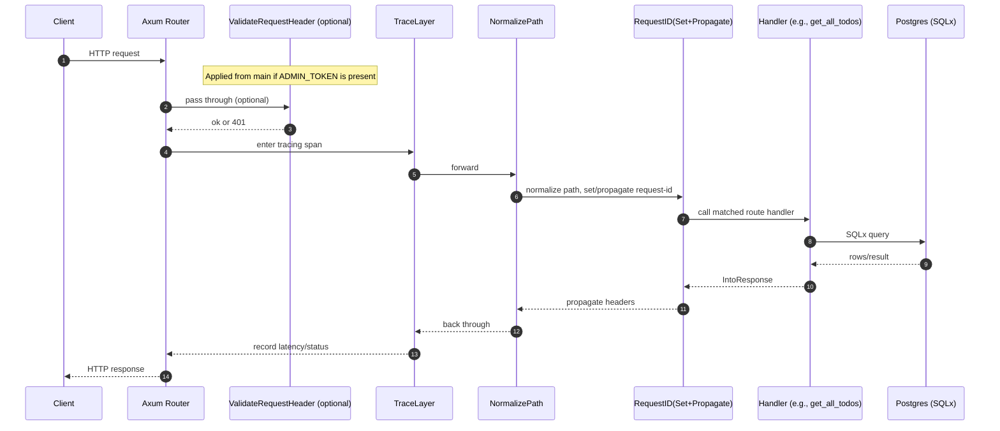

# Architecture

This service is an Axum-based REST API deployed with Shuttle. It follows a layered composition:

- Entry point: initializes telemetry, runs migrations, builds the router, and optionally applies a bearer auth layer using an ADMIN_TOKEN secret.
- Configuration: strongly-typed server configuration and CORS policy, loaded from environment.
- Application state: shared state (PgPool and ServerConfig) injected into request handlers.
- Server composition: central place that wires routes, state, and middleware layers into an Axum Router.
- Routes/handlers: HTTP endpoints for health and Todo CRUD interactions (example includes list/create) with SQLx-backed persistence.
- Middleware: request tracing, path normalization, request ID generation/propagation, optional CORS, and optional bearer authorization at the edge.
- Observability: structured logs and tracing via tracing-subscriber and tower-http TraceLayer.

Layers and responsibilities
- TraceLayer (outermost internal layer): request/response spans and latency logging.
- Request ID stack: SetRequestIdLayer + PropagateRequestIdLayer using a configurable header to generate and forward a UUID for each request.
- NormalizePathLayer: trims trailing slashes to normalize route matching.
- CORS (optional): configured per environment to allow specific origins or fully permissive for local dev.
- ValidateRequestHeaderLayer::bearer (optional, outer edge from main): static bearer token gate if ADMIN_TOKEN is present.

Modules overview (source)
- src/main.rs
  - Loads ServerConfig, creates AppState, builds Server and Router.
  - Runs sqlx migrations.
  - Applies optional ValidateRequestHeaderLayer::bearer.
- src/config/
  - server_config.rs: ServerConfig and CorsPolicy.
  - app_state.rs: AppState with PgPool and ServerConfig, constructor new().
- src/models/
  - server.rs: Server composition (router(), layer ordering), holds AppState and Middleware.
  - todo.rs: Todo domain model (used by routes with SQLx mapping).
- src/routes/
  - routes.rs: health, get_all_todos, create_todo handlers; use AppState and SQLx queries.
- src/middleware/
  - middleware.rs: Middleware struct and MiddlewareSuite impl producing concrete tower layers; optional cors_layer() built from config.

Mermaid: Module overview
```mermaid
flowchart LR
  subgraph bin[Entry Point]
    MAIN[src/main.rs]
  end

  subgraph cfg[Configuration]
    SC[ServerConfig]
    CP[CorsPolicy]
    AS[AppState]
  end

  subgraph mdl[Models]
    SRV[Server (composition)]
    TODO[Todo]
  end

  subgraph rts[Routes]
    H[health]
    G[get_all_todos]
    C[create_todo]
  end

  subgraph mw[Middleware]
    MW[Middleware]
    RID[Request ID stack]
    NP[NormalizePath]
    TR[Trace]
    CORS[CORS (optional)]
  end

  EXT[Shuttle, Axum, SQLx, tower-http]:::ext

  classDef ext fill:#eee,stroke:#666,color:#333;

  MAIN --> SC
  MAIN --> AS
  MAIN --> SRV

  SC -.defines .-> CP
  AS -->|holds| SC

  SRV -->|builds| rts
  SRV -->|applies| mw
  SRV -->|uses| AS

  rts -->|handlers use| TODO
  rts -->|depend on| AS

  MW --> RID
  MW --> NP
  MW --> TR
  MW --> CORS

  EXT --- MAIN
  EXT --- rts
  EXT --- MW
```

Mermaid: Request lifecycle


Notes on ordering
- Within Server.router(): NormalizePath -> Request ID stack -> TraceLayer (Trace is the outermost of these three). If CORS is enabled, it is applied on top of that stack when building the router in Server (see mw.cors_layer()).
- In main.rs, after the router is constructed, an additional outer ValidateRequestHeaderLayer::bearer may be applied, making it the first check for all requests.

Data flow and persistence
- Handlers extract AppState via axum::extract::State, then use state.pool (PgPool) for SQLx queries.
- Database migrations are executed at startup (sqlx::migrate!()).
- JSON request/response bodies are handled via axum::Json and Serde.

Observability
- tracing_subscriber registry reads RUST_LOG and configures env filters (e.g., info,tower_http=info,sqlx=warn).
- tower-http TraceLayer records request/response spans and timing; Request IDs enable log correlation across layers and services.

